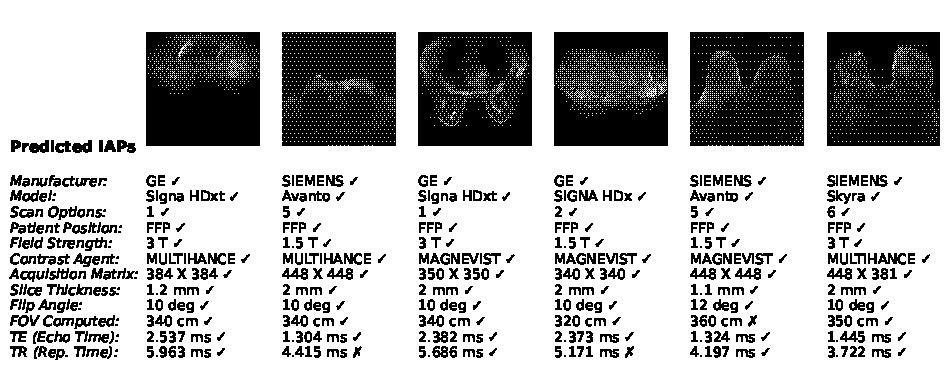
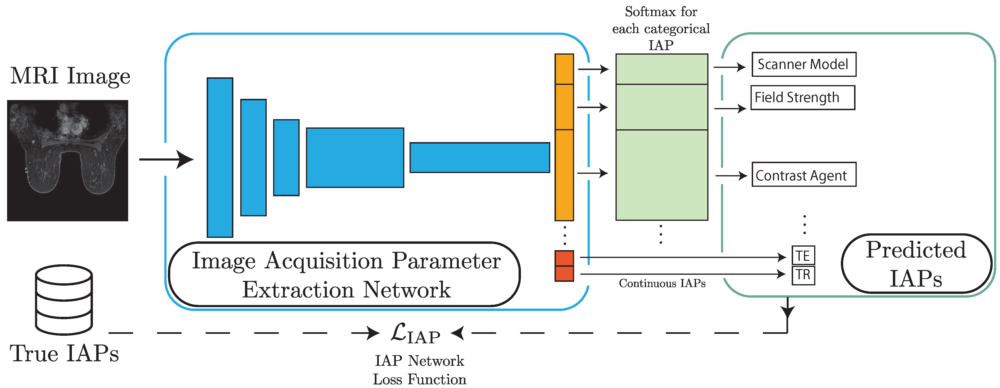

# Predicting MRI Acquisition Parameters Solely from Images using Deep Learning 

#### By [Nicholas Konz](https://nickk124.github.io/) and [Maciej Mazurowski](https://sites.duke.edu/mazurowski/).

[](https://arxiv.org/abs/2303.04911)

This is the official repository for our MIDL 2023 paper [*Reverse Engineering Breast MRIs: Predicting Acquisition Parameters Directly from Images*](https://arxiv.org/abs/2303.04911), where we introduce a neural network model that can predict many acquisition parameters that generated a breast MR image, using only the image itself, to high accuracy in a single forward pass.



## Trained model
Our trained PyTorch model checkpoint is [here](https://drive.google.com/file/d/1VNpXst4jDASJE0thntL__3Pns_16Ai-H/view).

## How To Use Our Code / Reproduce Our Results

### (0) Requirements

You'll need the Python packages outlined in `requirements.txt`, to run with Python 3, along with an updated version of PyTorch. These can be accomplished with:

```
pip3 install -r requirements.txt
pip3 install torch torchvision torchaudio --extra-index-url https://download.pytorch.org/whl/cu113
```

### (1) Data setup
Please follow the instuctions in `data_setup_guide.md`.

### (2) Training and Testing IAP Prediction Model on Breast MRIs
Run `main.py` to train and test our model with the same settings as in the paper. As a side note, the new IAP prediction loss is found in `src/IAP_model.py`.

You can find our trained model [here](https://drive.google.com/file/d/1VNpXst4jDASJE0thntL__3Pns_16Ai-H/view), if you don't want to train from scratch on your own dataset.

### (3) Analyzing Dataset IAP Distributions and Statistics
These results were shown in the paper's supplementary materials; they can be reproduced with `analyze_IAPs.py`.

## Citation

Please cite the paper if you use or reference it in your work (published version to be released):
```bib
@inproceedings{konz2023reverse,
  title={Reverse Engineering Breast MRIs: Predicting Acquisition Parameters Directly from Images},
  author={Konz, Nicholas and Mazurowski, Maciej A},
  booktitle={Medical Imaging with Deep Learning},
  year={2023}
}
```

### Paper Abstract

The image acquisition parameters (IAPs) used to create MRI scans are central to defining the appearance of the images. Deep learning models trained on data acquired using certain parameters might not generalize well to images acquired with different parameters. Being able to recover such parameters directly from an image could help determine whether a deep learning model is applicable, and could assist with data harmonization and/or domain adaptation. Here, we introduce a neural network model that can predict many complex IAPs used to generate an MR image with high accuracy solely using the image, with a single forward pass. These predicted parameters include field strength, echo and repetition times, acquisition matrix, scanner model, scan options, and others. Even challenging parameters such as contrast agent type can be predicted with good accuracy. We perform a variety of experiments and analyses of our model's ability to predict IAPs on many MRI scans of new patients, and demonstrate its usage in a realistic application. Predicting IAPs from the images is an important step toward better understanding the relationship between image appearance and IAPs. This in turn will advance the understanding of many concepts related to the generalizability of neural network models on medical images, including domain shift, domain adaptation, and data harmonization.

See our MIDL 2023 paper here:

- arXiv preprint version (open access): [https://arxiv.org/abs/2303.04911](https://arxiv.org/abs/2303.04911)
- published version: upcoming

## Our Contributions

1. We introduce a neural network model for predicting many categorical and continuous image acquisition parameters (IAPs) of a breast MR image in one forward pass, trained via multi-task learning.
2. We show that our model predicts many complex IAPs of MRI scans of new patients to high accuracy, over a test set of about 2,000 slice images, with a series of experiments. We predict six out of ten categorical IAPs to >97% top-1 accuracy on the test set, and all but two with >95% top-2 accuracy.
3. We show that our method achieves fair accuracy (>84% top-1 accuracy, >95% top-2) on IAPs that are more challenging to predict, such as contrast agent type.
4. We demonstrate a realistic application of our model: using it to sort new unlabeled data into different domains to determine which models to apply to the data for a downstream task.


